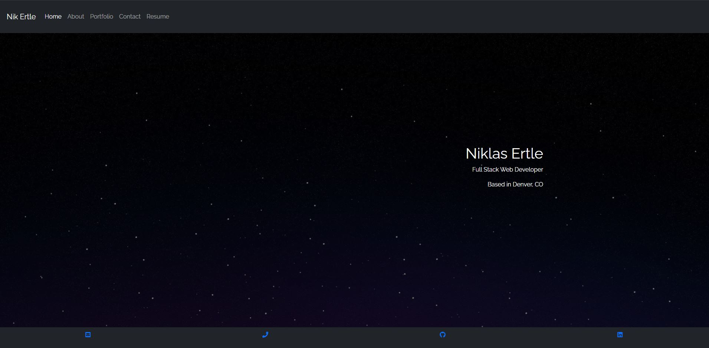

# Nik's React Porfolio

# Table of Contents

[Description](#description) -
[Usage](#usage) - 
[Links](#links) - 
[Contact](#contact) -
[Technologies](#technologies)

## Description

This is a portfolio page for myself built using React. One of the challenges when developing this application was making it responsive to mobile screens. Especially the navbar component. This was because the classes in bootstrap use its Javascript library which is coded in jQuery and doesn't work in React without some work arounds that I deemed not worth it to implement. So instead I built out the collapsable navbar using useState from React. 

## Usage

When ready use **'npm start'** into the command line to run the application.

## Links

  
[Walkthrough Video](https://youtu.be/ndaKpC1cLII)  
[Deployed App](https://niklasertle.github.io/react-portfolio/)  
[GitHub](https://github.com/niklasertle/react-portfolio)

## Contact

[GitHub Profile](https://github.com/niklasertle) 
[Email Me](mailto:nik.ertle16@gmail.com)

## Technologies

